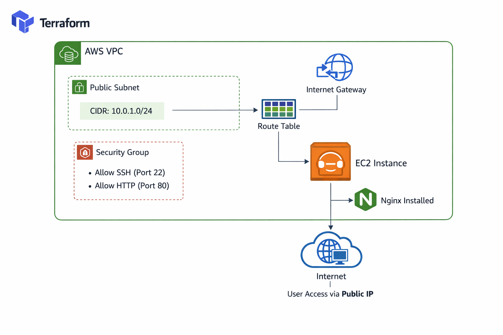
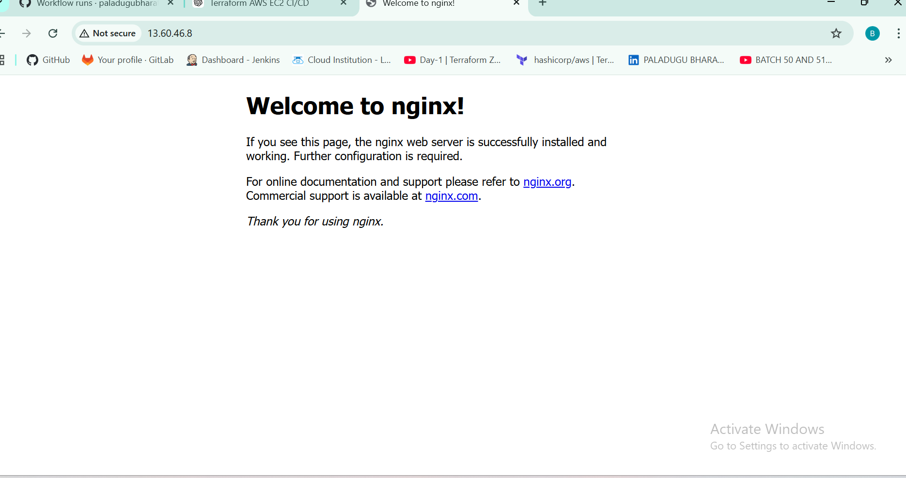
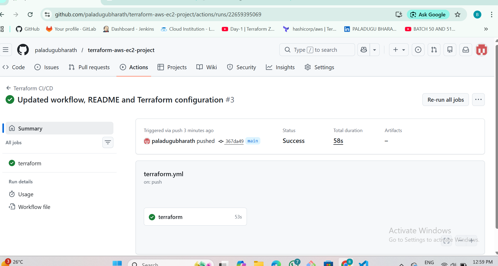

#  AWS Infrastructure Automation using Terraform with CI/CD

##  Project Overview

This project provisions AWS infrastructure using Terraform (Infrastructure as Code) and automates deployment using GitHub Actions CI/CD pipeline.

An EC2 instance is created inside a custom VPC and automatically installs and runs Nginx using a user_data script.
---

## Architecture

The following AWS resources are created:

- VPC
- Public Subnet
- Internet Gateway
- Route Table
- Security Group
- EC2 Instance (Amazon Linux)
- Nginx Web Server (Installed via user_data)

---

## 🖼️ Architecture Diagram

---

## ⚙️ Technologies Used

- Terraform (HashiCorp)
- AWS EC2
- AWS VPC
- AWS Security Groups
- GitHub Actions (CI/CD)
- Nginx Web Server
- VS Code

---

## 📂 Project Structure

terraform-aws-ec2-project/
│
├── main.tf
├── variables.tf
├── outputs.tf
├── provider.tf
├── .github/workflows/terraform.yml
├── README.md
└── screenshots/

---

## 🔐 Security Best Practices

- AMI ID is passed using Terraform variables (not hardcoded)
- Sensitive files are excluded using .gitignore
- AWS credentials are stored securely in GitHub Secrets
- terraform.tfstate is not pushed to GitHub

---

## 🚀 How to Deploy

### Step 1: Initialize Terraform

terraform init

### Step 2: Validate Configuration

terraform validate

### Step 3: Plan Infrastructure

terraform plan

### Step 4: Apply Infrastructure

terraform apply

### Step 5: Destroy Infrastructure (After Testing)

terraform destroy

---

## 📤 CI/CD Pipeline

This project uses GitHub Actions to automate:

- terraform init
- terraform plan
- terraform apply

Pipeline runs automatically on push to main branch.

---

## 🔄 GitHub Actions Workflow

Workflow file location:

.github/workflows/terraform.yml

---

## 📸 Project Screenshots

### 1️⃣ EC2 Instance Created

---

### 2️⃣ Nginx Running in Browser

---

### 3️⃣ CI/CD Pipeline Execution

---

## 📊 Terraform Output Example

After successful apply:

public_ip = "xx.xx.xx.xx"

Access in browser:

http://<public-ip>

---

## 🎯 Key Learning Outcomes

- Implemented Infrastructure as Code using Terraform
- Automated AWS resource provisioning
- Configured Security Groups for secure access
- Implemented CI/CD using GitHub Actions
- Followed cloud security best practices
